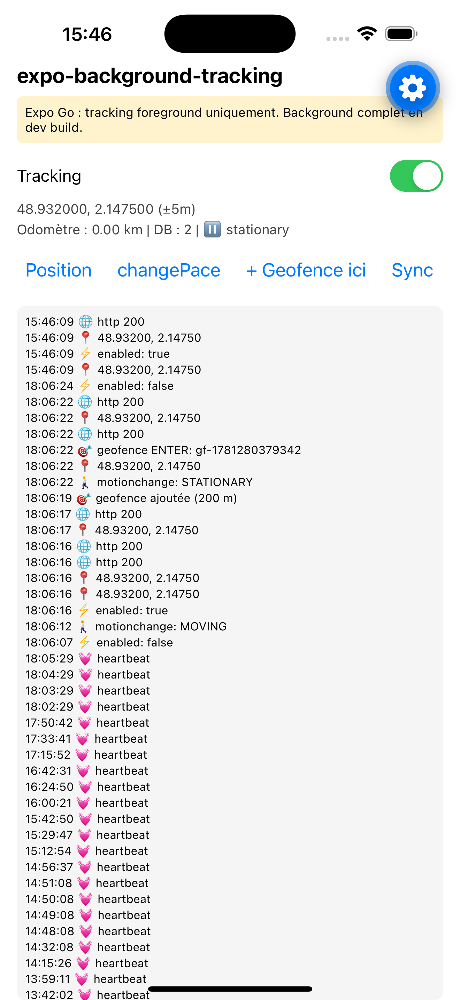

# expo-background-tracking — test app

A minimal Expo app that exercises the full `expo-background-tracking` API.



**What it demonstrates:**
- Live GPS tracking with distance filter and odometer
- Motion detection (MOVING / STATIONARY)
- Geofencing — add a geofence at the current position, receive ENTER/EXIT/DWELL events
- Heartbeat events while stationary
- HTTP sync with live status (200 / error)
- Full event log scrollable in-app

## Run

```bash
cd testapp
npm install
npx expo start --clear
```

Open in **Expo Go** for foreground-only tracking, or build a **development build** for full background support.
